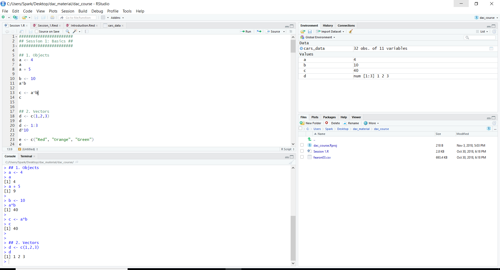
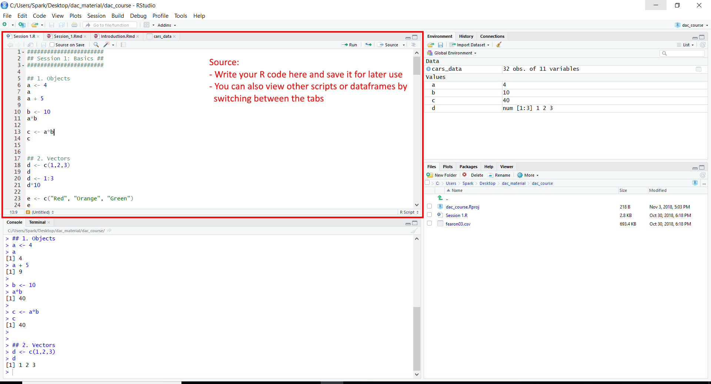
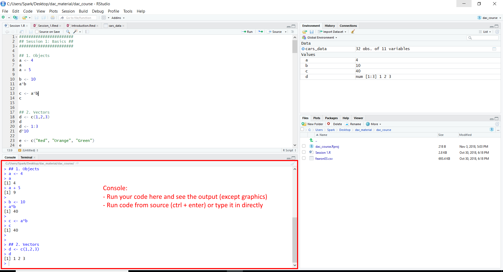
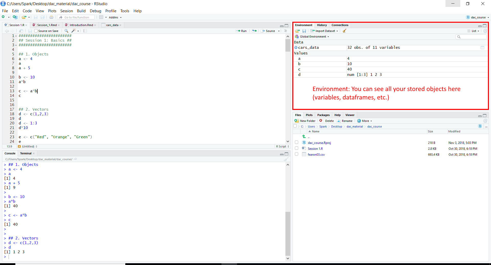
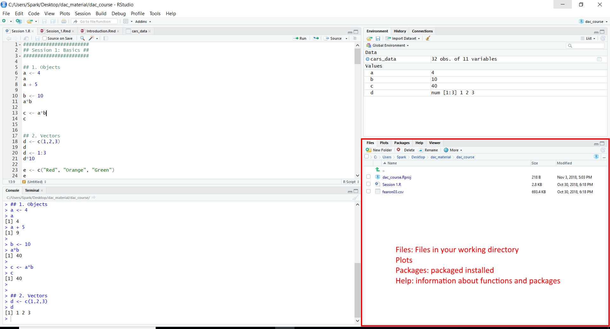

```{r setup, include=FALSE}

pacman::p_load(tidyverse, 
               stargazer, 
               pander, 
               knitr, 
               ggplot2, 
               kableExtra,
               XML)

knitr::opts_knit$set(root.dir = normalizePath(".."))

```


## What is R?

R is statistical software that you can use to build, clean, analyze, visualize your data.


## Building & Cleaning

```{r, echo = F}


kable(head(mtcars, n = 8)[ , 1:6],
      caption = "Automobile Performance") 


```


## Analyzing

```{r, echo = F, results='asis'}


mpg_linear_model <- lm(mpg ~ cyl + hp + gear + wt, data = mtcars)

stargazer(mpg_linear_model, 
          type = 'latex', 
          header = F,
          font.size = "tiny",
          column.sep.width = "1pt",
          single.row = TRUE)


```


## Visualizing

```{r, echo = F}

# create factors with value labels 
mtcars$gear <- factor(mtcars$gear,levels=c(3,4,5),
  	labels=c("3gears","4gears","5gears")) 
mtcars$am <- factor(mtcars$am,levels=c(0,1),
  	labels=c("Automatic","Manual")) 
mtcars$cyl <- factor(mtcars$cyl,levels=c(4,6,8),
   labels=c("4cyl","6cyl","8cyl")) 

# Kernel density plots for mpg
# grouped by number of gears (indicated by color)
qplot(mpg, data=mtcars, geom="density", fill=gear, alpha=I(.5), 
   main="Distribution of Gas Milage", xlab="Miles Per Gallon", 
   ylab="Density")


```


## Can't Stata and SPSS do this as well?

R is more powerful and flexible: Code-based UI allows for more functions, which can also be customized.
  - No limits to variables and observations like Stata or SPSS
  - A stepping stone for coding in general

R is open source: New functions and packages being added and updated constantly. Much less restricted to the version you have.


## Course Schedule

- Session 1 (Nov 7): Intro to R, basic functions
- Session 2 (Nov 14): Data manipulation
- Session 3 (Nov 21): Data visualization
- Session 4 (Nov 28): Data presentation + ?


## R studio interface




## R studio interface




## R studio interface



## R studio interface




## R studio interface




